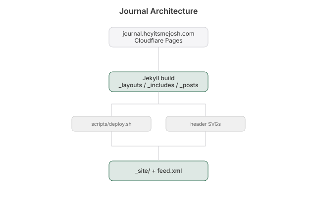

# Journal

  [](https://github.com/nulljosh/journal)

Personal Jekyll blog.
Live at [journal.heyitsmejosh.com](https://journal.heyitsmejosh.com).

Split out of the `inkpress` repo 2026-07-21: this is the blog only. The Inkpress
iOS app (a general-purpose multi-feed RSS reader) lives at
[github.com/nulljosh/inkpress](https://github.com/nulljosh/inkpress) and can
subscribe to this blog's own `feed.xml` as one of its feeds — that's the whole
connection between the two, nothing shared beyond that.

## Features
- Local Jekyll dev server via `bundle exec jekyll serve` at `http://localhost:4000/`.
- Posts live in `_posts/` named `YYYY-MM-DD-title.md` with front matter template and guidance to write like a normal person with no jargon pileup.
- `./scripts/deploy.sh` is the only publish path. Builds Jekyll locally, outputs to `_site/`, then deploys prebuilt static to Vercel via `vercel deploy --prebuilt`. No GitHub Pages, no remote build — a plain `git push` does not deploy.

## Run
```bash
bundle install
bundle exec jekyll serve
./scripts/deploy.sh
```

## Roadmap
- [ ] Add a drafts workflow that previews unpublished posts without shipping.
- [ ] Add automatic image optimization for post assets.

## Changelog
v2.4.0
- Split out of the `inkpress` repo into its own repo (2026-07-21) — see Inkpress's own README for the RSS reader app side.

v2.3.0
- Journal now shares the portfolio's design tokens (`heyitsmejosh.com/tokens.css`); blue accent used for links, hover states, and theme toggle.

v2.2.0
- Switched to Vercel prebuilt deployment via `./scripts/deploy.sh`. No GitHub Actions, no gh-pages.
- Fixed light-mode `.dim` CSS in Apr 26, May 1, May 8 SVG headers (was `rgba(255,255,255,0.25)`, now `rgba(0,0,0,0.25)`).

v2.1.0
- Weekly SVG headers switched to monochrome palette with `prefers-color-scheme` theming to match the site CSS.
- Post URL note: slug derives from filename, not title. Name files `YYYY-MM-DD-slug.md` with the slug you want in the URL.

v2.0.0
- Documented local Jekyll serve workflow and localhost preview.
- Defined post naming, front matter, and writing guidance for entries.
- Added a ship script that validates posts, builds cleanly, previews today, and publishes to `main` and `gh-pages`.

## License
MIT 2026 Joshua Trommel

## Whitepaper

[Technical whitepaper](WHITEPAPER.md)

## Architecture


